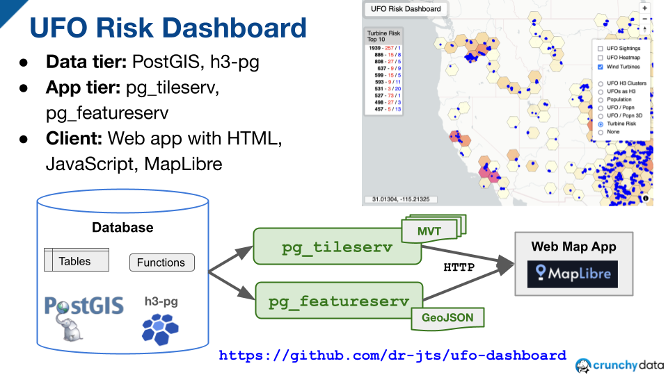

#  UFO Risk Dashboard
A web map app for a UFO Risk Dashboard.
Uses [PostGIS](https://postgis.net/), [H3-pg](https://github.com/zachasme/h3-pg), [pg_tileserv](https://github.com/CrunchyData/pg_tileserv), [pg_featureserv](https://github.com/CrunchyData/pg_featureserv), [MapLibre](https://maplibre.org/).

## Datasets

### US UFO Sightings

* Format: CSV
* Link: [Ufo Sightings CSV File](https://corgis-edu.github.io/corgis/csv/ufo_sightings/)

### US Wind Turbine locations

* Format: CSV
* Link: [Wind Turbines CSV File](https://corgis-edu.github.io/corgis/csv/wind_turbines/)

### Kontur population data in H3

* Format: Geopackage
* Link: [Global Population Density for 22km (Res 4) H3 Hexagons](https://data.humdata.org/dataset/kontur-population-dataset-22km)

## Code Artifacts

### PostGIS Functions

* https://github.com/dr-jts/ufo-dashboard/blob/main/ST_TileEnvelopeClip.sql
  * only needed as a patch for bug https://trac.osgeo.org/postgis/ticket/5799 
  
### pg_tileserv Functions
* https://github.com/dr-jts/ufo-dashboard/blob/main/ufo_h3_fn.sql
* https://github.com/dr-jts/ufo-dashboard/blob/main/ufo_cluster_h3_fn.sql
* https://github.com/dr-jts/ufo-dashboard/blob/main/ufo_turbine_risk_h3_fn.sql

### pg_featureserv Views
* https://github.com/dr-jts/ufo-dashboard/blob/main/ufo_turbine_risk_h3_r6_vw.sql

### Web Map App
* https://github.com/dr-jts/ufo-dashboard/blob/main/ufo_dashboard.html

